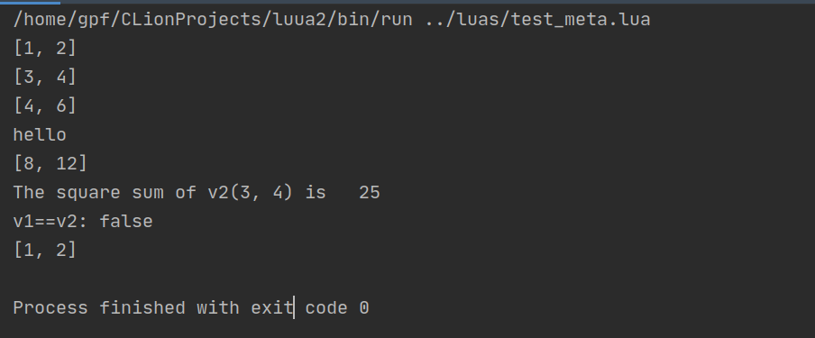
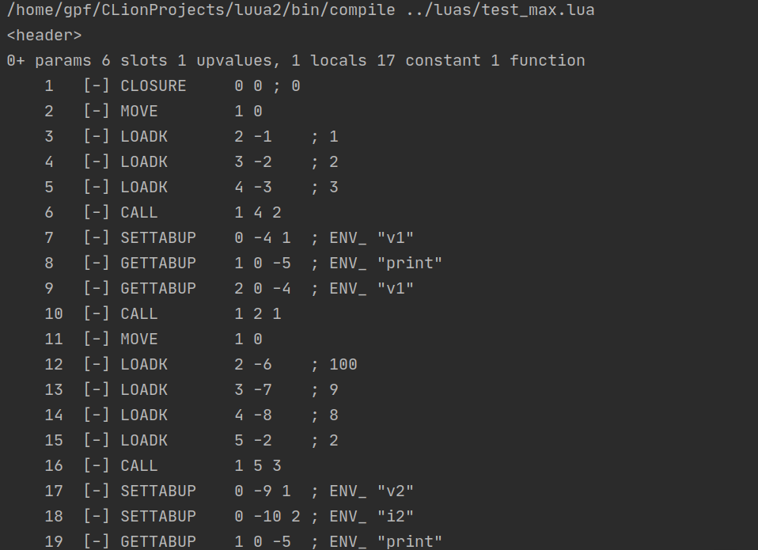

##  一个简单的Lua解释器

主要包括两部分，一个编译到字节码的编译器和一个虚拟机。编译器实现了大部分语句的编译，除了goto语句。虚拟机用来执行字节码。

### 开发环境

ubuntu 18.04

Clion 2020.2

g++ -std 14

工程的具体结构如下表：

| 文件夹  | 内容                      |
| ------- | ------------------------- |
| src     | 所有源代码                |
| test    | 编译部分测试(Google test) |
| example | 生成的可执行文件          |


example下的具体文件如下：

|         |                            |
| ------- | -------------------------- |
| exevm   | 执行lua编译好的二进制chunk |
| compile | 编译源代码输出字节码       |
| run     | 编译+ 执行                 |


#### build 

```bash
mkdir build 
cd build 
cmake ..
make
```


### run

```bash
./run test_meta.lua
```


run程序测试结果如下：

源代码：

```lua
local mt = {}

function vector(x, y)
    local v = {x=x, y= y}
    setmetatable(v, mt)
    return v
end

mt.__call= function(v)
    print("[".. v.x .. ", " .. v.y .. "]")
end

mt.__add = function(v1, v2)
    return vector(v1.x + v2.x, v1.y + v2.y)
end

mt.__mul = function(v1, n)
    return vector(v1.x * n, v1.y * n)
end

mt.__len = function(v)
    return (v.x * v.x + v.y * v.y)
end

mt.__eq = function(v1, v2)
    return v1.x == v2.x and v1.y == v2.y
end

mt.__index = function (v, k)
    if k == "print" then
        return function ()
            print("[".. v.x .. ", " .. v.y .. "]")
        end
    end
end


v1 = vector(1, 2); v1()
v2 = vector(3, 4); v2()

-- test arich method
v3 = v1 + v2
v3()

print("hello")

local v4 = v3*2
v4()

print("The square sum of v2(3, 4) is ", #v2)
print("v1==v2:", v1==v2)

local pr =  v1.print
--print(pr)
pr()

--v2:print()
```


虚拟机执行结果：



```bash
./compile test_meta.lua
```


部分编译结果：




### 后续要做

1. 优化编译器

3. 实现协程
4. （JIT）


### 参考

1. [Lua官方源码](https://github.com/lua/lua)
2. [《Lua程序设计》](https://book.douban.com/subject/30262035/)

3. [《Lua设计与实现》](https://book.douban.com/subject/27108476/)
4. [《自己动手实现Lua》](https://book.douban.com/subject/30348061/)